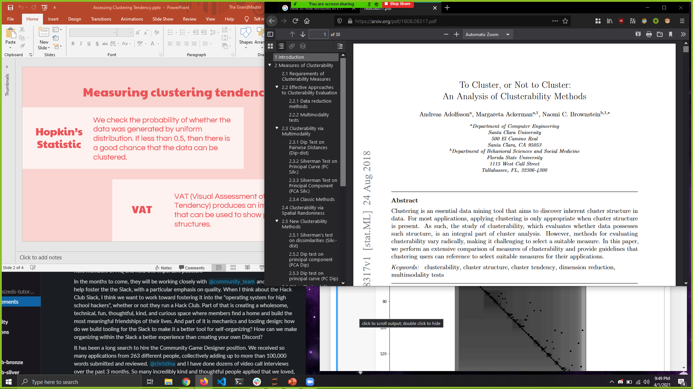
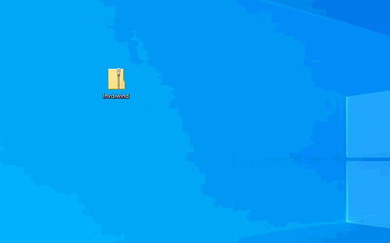
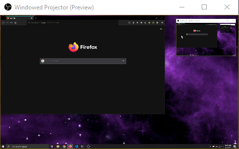

# Invisiwind

Invisiwind (short for _Invisible Window_) is an application that allows you to hide certain windows when sharing your full screen.

## So .. what does it do exactly?

I think this is best explained with a couple of screenshots I took during a Zoom meeting:

  
  

The screenshot on the left is what I see. The one on the right is what everyone else sees.

Using this tool, firefox and slack have been hidden so anyone watching the screenshare is unable to see those windows. However, I can continue to use them as usual on my side.

_Note: this tool works with any app (MS Teams, Discord, OBS, etc) and not just Zoom._

### So .. what does it do exactly? (for technical people)

Simple: The tool performs dll injection to [SetWindowDisplayAffinity](https://docs.microsoft.com/en-us/windows/win32/api/winuser/nf-winuser-setwindowdisplayaffinity) to `WDA_EXCLUDEFROMCAPTURE`.

## How do I install it?

To use this application, you can either use the installer or the portable version.

### Use the installer (recommended)

 - Download and run [InvisiwindInstaller.exe](https://github.com/radiantly/Invisiwind/releases/download/latest/InvisiwindInstaller.exe).
 - Once the installation is complete, you will be able to run `Invisiwind` from the Start Menu.

### Download the portable zip

- Download and extract the generated zip bundle from [here](https://github.com/radiantly/Invisiwind/releases/download/latest/Invisiwind.zip).
- Run `Invisiwind.exe`. You will now be dropped into a terminal.

Running it directly drops you into interactive mode. You can type `help` for more information.

You can also directly invoke it with commandline arguments. Type `invisiwind --help` for argument specification.

## FAQ

#### What OSes are supported?

Windows 10 v2004 or above. On previous versions of windows, a black screen shows up instead of hiding the window.

#### Do future instances of the application get automatically hidden?

No

#### Is it possible to see a preview of the screen on my side?

You can use something like OBS's Windowed projector.

_Tip: you can hide this window from view too._

#### Could I automatically hide windows using a hotkey?

Yes! In the zip bundle you'll find a AutoHotkey script that hides windows when you press Ctrl+J. Feel free to customize.

## Contributing

Feel free to open an issue/PR if you find a bug or would like to contribute!
